```mermaid
flowchart TB
    subgraph current["SocialManager.Documentation.csproj"]
        MAIN["<b>📦&nbsp;SocialManager.Documentation.csproj</b><br/><small>net9.0</small>"]
        click MAIN "#documentationsocialmanagerdocumentationsocialmanagerdocumentationcsproj"
    end

```

```mermaid
flowchart TB
    subgraph upstream["Dependants (1)"]
        P2["<b>📦&nbsp;SocialManager.csproj</b><br/><small>net9.0</small>"]
        click P2 "#srcsocialmanagersocialmanagercsproj"
    end
    subgraph current["SocialManager.Admin.API.csproj"]
        MAIN["<b>📦&nbsp;SocialManager.Admin.API.csproj</b><br/><small>net9.0</small>"]
        click MAIN "#srcadminsocialmanageradminapisocialmanageradminapicsproj"
    end
    P2 --> MAIN

```

```mermaid
flowchart TB
    subgraph upstream["Dependants (1)"]
        P2["<b>📦&nbsp;SocialManager.csproj</b><br/><small>net9.0</small>"]
        click P2 "#srcsocialmanagersocialmanagercsproj"
    end
    subgraph current["SocialManager.Admin.csproj"]
        MAIN["<b>📦&nbsp;SocialManager.Admin.csproj</b><br/><small>net9.0</small>"]
        click MAIN "#srcadminsocialmanageradminsocialmanageradmincsproj"
    end
    P2 --> MAIN

```

```mermaid
flowchart TB
    subgraph current["SocialManager.Aspire.Host.csproj"]
        MAIN["<b>📦&nbsp;SocialManager.Aspire.Host.csproj</b><br/><small>net8.0</small>"]
        click MAIN "#srcaspiresocialmanageraspirehostsocialmanageraspirehostcsproj"
    end
    subgraph downstream["Dependencies (1"]
        P2["<b>📦&nbsp;SocialManager.csproj</b><br/><small>net9.0</small>"]
        click P2 "#srcsocialmanagersocialmanagercsproj"
    end
    MAIN --> P2

```

```mermaid
flowchart TB
    subgraph upstream["Dependants (1)"]
        P2["<b>📦&nbsp;SocialManager.csproj</b><br/><small>net9.0</small>"]
        click P2 "#srcsocialmanagersocialmanagercsproj"
    end
    subgraph current["SocialManager.Aspire.ServiceDefaults.csproj"]
        MAIN["<b>📦&nbsp;SocialManager.Aspire.ServiceDefaults.csproj</b><br/><small>net8.0</small>"]
        click MAIN "#srcaspiresocialmanageraspireservicedefaultssocialmanageraspireservicedefaultscsproj"
    end
    P2 --> MAIN

```

```mermaid
flowchart TB
    subgraph upstream["Dependants (1)"]
        P3["<b>📦&nbsp;SocialManager.Aspire.Host.csproj</b><br/><small>net8.0</small>"]
        click P3 "#srcaspiresocialmanageraspirehostsocialmanageraspirehostcsproj"
    end
    subgraph current["SocialManager.csproj"]
        MAIN["<b>📦&nbsp;SocialManager.csproj</b><br/><small>net9.0</small>"]
        click MAIN "#srcsocialmanagersocialmanagercsproj"
    end
    subgraph downstream["Dependencies (3"]
        P5["<b>📦&nbsp;SocialManager.Admin.csproj</b><br/><small>net9.0</small>"]
        P6["<b>📦&nbsp;SocialManager.Admin.API.csproj</b><br/><small>net9.0</small>"]
        P4["<b>📦&nbsp;SocialManager.Aspire.ServiceDefaults.csproj</b><br/><small>net8.0</small>"]
        click P5 "#srcadminsocialmanageradminsocialmanageradmincsproj"
        click P6 "#srcadminsocialmanageradminapisocialmanageradminapicsproj"
        click P4 "#srcaspiresocialmanageraspireservicedefaultssocialmanageraspireservicedefaultscsproj"
    end
    P3 --> MAIN
    MAIN --> P5
    MAIN --> P6
    MAIN --> P4

```

# Projects and dependencies analysis

This document provides a comprehensive overview of the projects and their dependencies in the context of upgrading to .NET 9.0.

## Table of Contents

- [Projects Relationship Graph](#projects-relationship-graph)
- [Project Details](#project-details)

  - [documentation\SocialManager.Documentation\SocialManager.Documentation.csproj](#documentationsocialmanagerdocumentationsocialmanagerdocumentationcsproj)
  - [src\Admin\SocialManager.Admin.API\SocialManager.Admin.API.csproj](#srcadminsocialmanageradminapisocialmanageradminapicsproj)
  - [src\Admin\SocialManager.Admin\SocialManager.Admin.csproj](#srcadminsocialmanageradminsocialmanageradmincsproj)
  - [src\Aspire\SocialManager.Aspire.Host\SocialManager.Aspire.Host.csproj](#srcaspiresocialmanageraspirehostsocialmanageraspirehostcsproj)
  - [src\Aspire\SocialManager.Aspire.ServiceDefaults\SocialManager.Aspire.ServiceDefaults.csproj](#srcaspiresocialmanageraspireservicedefaultssocialmanageraspireservicedefaultscsproj)
  - [src\SocialManager\SocialManager.csproj](#srcsocialmanagersocialmanagercsproj)
- [Aggregate NuGet packages details](#aggregate-nuget-packages-details)

## Projects Relationship Graph

Legend:
📦 SDK-style project
⚙️ Classic project

```mermaid
flowchart LR
    P1["<b>📦&nbsp;SocialManager.Documentation.csproj</b><br/><small>net9.0</small>"]
    P2["<b>📦&nbsp;SocialManager.csproj</b><br/><small>net9.0</small>"]
    P3["<b>📦&nbsp;SocialManager.Aspire.Host.csproj</b><br/><small>net8.0</small>"]
    P4["<b>📦&nbsp;SocialManager.Aspire.ServiceDefaults.csproj</b><br/><small>net8.0</small>"]
    P5["<b>📦&nbsp;SocialManager.Admin.csproj</b><br/><small>net9.0</small>"]
    P6["<b>📦&nbsp;SocialManager.Admin.API.csproj</b><br/><small>net9.0</small>"]
    P2 --> P5
    P2 --> P6
    P2 --> P4
    P3 --> P2
    click P1 "#documentationsocialmanagerdocumentationsocialmanagerdocumentationcsproj"
    click P2 "#srcsocialmanagersocialmanagercsproj"
    click P3 "#srcaspiresocialmanageraspirehostsocialmanageraspirehostcsproj"
    click P4 "#srcaspiresocialmanageraspireservicedefaultssocialmanageraspireservicedefaultscsproj"
    click P5 "#srcadminsocialmanageradminsocialmanageradmincsproj"
    click P6 "#srcadminsocialmanageradminapisocialmanageradminapicsproj"

```

## Project Details

### documentation\SocialManager.Documentation\SocialManager.Documentation.csproj

#### Project Info

- **Current Target Framework:** net9.0
- **Proposed Target Framework:** net10.0
- **SDK-style**: True
- **Project Kind:** ClassLibrary
- **Dependencies**: 0
- **Dependants**: 0
- **Number of Files**: 0
- **Lines of Code**: 0

#### Dependency Graph

Legend:
📦 SDK-style project
⚙️ Classic project

#### Project Package References

| Package | Type | Current Version | Suggested Version | Description |
| :--- | :---: | :---: | :---: | :--- |

### src\Admin\SocialManager.Admin.API\SocialManager.Admin.API.csproj

#### Project Info

- **Current Target Framework:** net9.0
- **Proposed Target Framework:** net10.0
- **SDK-style**: True
- **Project Kind:** AspNetCore
- **Dependencies**: 0
- **Dependants**: 1
- **Number of Files**: 3
- **Lines of Code**: 41

#### Dependency Graph

Legend:
📦 SDK-style project
⚙️ Classic project

#### Project Package References

| Package | Type | Current Version | Suggested Version | Description |
| :--- | :---: | :---: | :---: | :--- |
| Microsoft.AspNetCore.OpenApi | Explicit | 9.0.10 | 10.0.0 | NuGet package upgrade is recommended |

### src\Admin\SocialManager.Admin\SocialManager.Admin.csproj

#### Project Info

- **Current Target Framework:** net9.0
- **Proposed Target Framework:** net10.0
- **SDK-style**: True
- **Project Kind:** ClassLibrary
- **Dependencies**: 0
- **Dependants**: 1
- **Number of Files**: 12
- **Lines of Code**: 33

#### Dependency Graph

Legend:
📦 SDK-style project
⚙️ Classic project

#### Project Package References

| Package | Type | Current Version | Suggested Version | Description |
| :--- | :---: | :---: | :---: | :--- |
| Microsoft.AspNetCore.Components.Web | Explicit | 9.0.10 | 10.0.0 | NuGet package upgrade is recommended |
| Microsoft.AspNetCore.Components.WebAssembly | Explicit | 9.0.10 | 10.0.0 | NuGet package upgrade is recommended |
| Microsoft.AspNetCore.Components.WebAssembly.Server | Explicit | 9.0.10 | 10.0.0 | NuGet package upgrade is recommended |

### src\Aspire\SocialManager.Aspire.Host\SocialManager.Aspire.Host.csproj

#### Project Info

- **Current Target Framework:** net8.0
- **Proposed Target Framework:** net10.0
- **SDK-style**: True
- **Project Kind:** DotNetCoreApp
- **Dependencies**: 1
- **Dependants**: 0
- **Number of Files**: 1
- **Lines of Code**: 3

#### Dependency Graph

Legend:
📦 SDK-style project
⚙️ Classic project

#### Project Package References

| Package | Type | Current Version | Suggested Version | Description |
| :--- | :---: | :---: | :---: | :--- |
| Aspire.Hosting.AppHost | Explicit | 8.2.2 | 13.0.0 | NuGet package upgrade is recommended |

### src\Aspire\SocialManager.Aspire.ServiceDefaults\SocialManager.Aspire.ServiceDefaults.csproj

#### Project Info

- **Current Target Framework:** net8.0
- **Proposed Target Framework:** net10.0
- **SDK-style**: True
- **Project Kind:** ClassLibrary
- **Dependencies**: 0
- **Dependants**: 1
- **Number of Files**: 1
- **Lines of Code**: 118

#### Dependency Graph

Legend:
📦 SDK-style project
⚙️ Classic project

#### Project Package References

| Package | Type | Current Version | Suggested Version | Description |
| :--- | :---: | :---: | :---: | :--- |
| Microsoft.Extensions.Http.Resilience | Explicit | 8.10.0 | 10.0.0 | NuGet package upgrade is recommended |
| Microsoft.Extensions.ServiceDiscovery | Explicit | 8.2.2 | 10.0.0 | NuGet package upgrade is recommended |
| OpenTelemetry.Exporter.OpenTelemetryProtocol | Explicit | 1.9.0 |  | ✅Compatible |
| OpenTelemetry.Extensions.Hosting | Explicit | 1.9.0 |  | ✅Compatible |
| OpenTelemetry.Instrumentation.AspNetCore | Explicit | 1.9.0 | 1.14.0-rc.1 | NuGet package upgrade is recommended |
| OpenTelemetry.Instrumentation.Http | Explicit | 1.9.0 | 1.14.0-rc.1 | NuGet package upgrade is recommended |
| OpenTelemetry.Instrumentation.Runtime | Explicit | 1.9.0 |  | ✅Compatible |

### src\SocialManager\SocialManager.csproj

#### Project Info

- **Current Target Framework:** net9.0
- **Proposed Target Framework:** net10.0
- **SDK-style**: True
- **Project Kind:** AspNetCore
- **Dependencies**: 3
- **Dependants**: 1
- **Number of Files**: 16
- **Lines of Code**: 205

#### Dependency Graph

Legend:
📦 SDK-style project
⚙️ Classic project

#### Project Package References

| Package | Type | Current Version | Suggested Version | Description |
| :--- | :---: | :---: | :---: | :--- |

## Aggregate NuGet packages details

| Package | Current Version | Suggested Version | Projects | Description |
| :--- | :---: | :---: | :--- | :--- |
| Aspire.Hosting.AppHost | 8.2.2 | 13.0.0 | [SocialManager.Aspire.Host.csproj](#socialmanageraspirehostcsproj) | NuGet package upgrade is recommended |
| Microsoft.AspNetCore.Components.Web | 9.0.10 | 10.0.0 | [SocialManager.Admin.csproj](#socialmanageradmincsproj) | NuGet package upgrade is recommended |
| Microsoft.AspNetCore.Components.WebAssembly | 9.0.10 | 10.0.0 | [SocialManager.Admin.csproj](#socialmanageradmincsproj) | NuGet package upgrade is recommended |
| Microsoft.AspNetCore.Components.WebAssembly.Server | 9.0.10 | 10.0.0 | [SocialManager.Admin.csproj](#socialmanageradmincsproj) | NuGet package upgrade is recommended |
| Microsoft.AspNetCore.OpenApi | 9.0.10 | 10.0.0 | [SocialManager.Admin.API.csproj](#socialmanageradminapicsproj) | NuGet package upgrade is recommended |
| Microsoft.Extensions.Http.Resilience | 8.10.0 | 10.0.0 | [SocialManager.Aspire.ServiceDefaults.csproj](#socialmanageraspireservicedefaultscsproj) | NuGet package upgrade is recommended |
| Microsoft.Extensions.ServiceDiscovery | 8.2.2 | 10.0.0 | [SocialManager.Aspire.ServiceDefaults.csproj](#socialmanageraspireservicedefaultscsproj) | NuGet package upgrade is recommended |
| OpenTelemetry.Exporter.OpenTelemetryProtocol | 1.9.0 |  | [SocialManager.Aspire.ServiceDefaults.csproj](#socialmanageraspireservicedefaultscsproj) | ✅Compatible |
| OpenTelemetry.Extensions.Hosting | 1.9.0 |  | [SocialManager.Aspire.ServiceDefaults.csproj](#socialmanageraspireservicedefaultscsproj) | ✅Compatible |
| OpenTelemetry.Instrumentation.AspNetCore | 1.9.0 | 1.14.0-rc.1 | [SocialManager.Aspire.ServiceDefaults.csproj](#socialmanageraspireservicedefaultscsproj) | NuGet package upgrade is recommended |
| OpenTelemetry.Instrumentation.Http | 1.9.0 | 1.14.0-rc.1 | [SocialManager.Aspire.ServiceDefaults.csproj](#socialmanageraspireservicedefaultscsproj) | NuGet package upgrade is recommended |
| OpenTelemetry.Instrumentation.Runtime | 1.9.0 |  | [SocialManager.Aspire.ServiceDefaults.csproj](#socialmanageraspireservicedefaultscsproj) | ✅Compatible |

